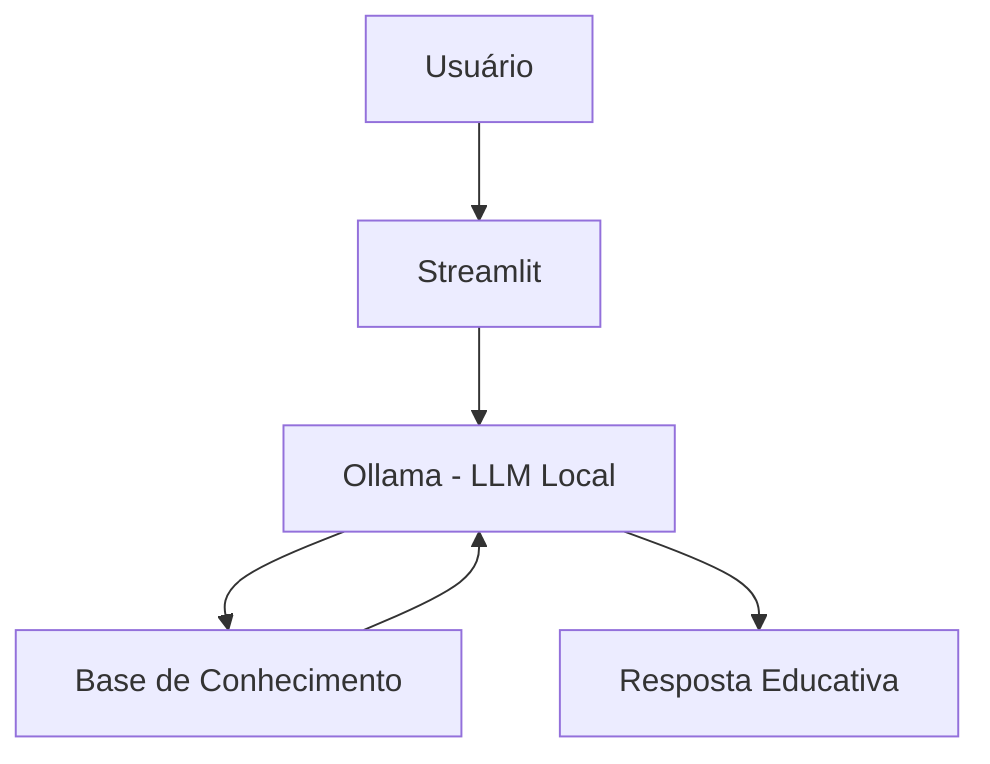

# 🎓 Pierre - Mentor de Python com IA

> Agente de IA Generativa que atua como mentor educacional de Python, ajudando estudantes a aprender programação de forma guiada, personalizada e contextualizada com base no histórico do próprio desenvolvedor.

---

## 💡 O Que é o Pierre?

O **Pierre** é um assistente educacional inteligente focado em Python que atua como um **tutor virtual personalizado**. Ele não apenas responde dúvidas, mas conduz o aprendizado do usuário utilizando técnicas de ensino guiado (scaffolding), exemplos práticos e análise do histórico de dificuldades do estudante.

O objetivo do Pierre é **ensinar a pensar como programador**, e não apenas entregar respostas prontas.

---

### 🧠 O que o Pierre faz:
- ✅ Explica conceitos de Python de forma didática e adaptada ao nível do aluno  
- ✅ Utiliza histórico de dúvidas para personalizar respostas  
- ✅ Aplica técnica de scaffolding (ensino guiado por perguntas)  
- ✅ Ajuda na interpretação de erros comuns de programação  
- ✅ Oferece exemplos práticos e progressivos  

---

### 🚫 O que o Pierre NÃO faz:
- ❌ Não responde perguntas fora do contexto de Python  
- ❌ Não ensina outras linguagens de programação  
- ❌ Não substitui o processo de aprendizado do desenvolvedor  

---

## 🏗️ Arquitetura



**Stack:**
- Interface: Streamlit
- LLM: Ollama (modelo local `gpt-oss`)
- Dados: JSON/CSV mockados

---

## 📁 Estrutura do Projeto

```text
.
├── data/
│   ├── erros_comuns.csv        # Base de erros comuns em Python com explicações e dicas guiadas
│   ├── historico_duvidas.csv   # Histórico de dúvidas do desenvolvedor para contextualização
│   └── perfil_dev.json         # Perfil do desenvolvedor (nível, objetivo e estilo de aprendizado)
│
├── docs/
│   ├── 01-documentacao-agente.md   # Definição do agente (problema, solução, persona e comportamento)
│   ├── 02-base-conhecimento.md     # Como os dados são carregados e utilizados pelo agente
│   ├── 03-prompts.md               # System prompt, regras e exemplos de interação (few-shot)
│   ├── 04-metricas.md              # Estratégia de avaliação e testes do agente
│   └── 05-pitch.md                 # Apresentação do projeto (problema, solução e diferencial)
│
├── src/
│   ├── README.md                   # Documentação da aplicação e instruções de uso
│   └── app.py                      # Aplicação principal (Streamlit + LLM via Ollama)
│
└── README.md                       # Visão geral do projeto, arquitetura e guia de execução
```
  
---

## 🚀 Como Executar

### 1. Instalar Ollama

```bash
# Baixar em: ollama.com
ollama pull gpt-oss
ollama serve
```

### 2. Instalar Dependências

```bash
pip install streamlit pandas requests
```

### 3. Rodar o Pierre

```bash
streamlit run src/app.py
```
---

## 💬 Exemplos de Uso

### Conceitos Básicos

* O que é uma lista em Python?
* Como funciona o loop for?
* O que são funções?

### Estruturas de Dados

* Qual a diferença entre lista e tupla?
* Quando devo usar um dicionário?

### Orientação a Objetos

* Explique herança em Python.
* O que são classes e objetos?

### Boas Práticas

* Como organizar um projeto Python?
* Como seguir os princípios do código limpo?

---

## 🎯 Objetivos do Projeto

Este projeto foi desenvolvido para consolidar conhecimentos em:

* Inteligência Artificial Generativa
* Engenharia de Prompt
* Modelos de Linguagem Locais (LLMs)
* Desenvolvimento de Aplicações com IA
* Python
* Integração com Ollama

---

## 🚀 Possíveis Evoluções

* Histórico de conversas
* Memória contextual
* Sistema de desafios personalizados
* Avaliação automática de exercícios
* Integração com documentação oficial do Python
* Suporte a múltiplos modelos
  
---

## 📊 Métricas de Avaliação

| Métrica | Objetivo |
|---------|----------|
| **Assertividade** | O agente responde corretamente o que foi perguntado? |
| **Segurança** | Evita inventar informações fora do contexto (redução de alucinação)? |
| **Coerência** | Mantém consistência com o papel de mentor de Python? |

## 🎬 Diferenciais

- 🧑‍🏫 **Mentor educacional especializado em Python:** o Pierre foi projetado para ensinar programação, guiando o aluno no raciocínio lógico em vez de apenas entregar respostas prontas  
- 🧠 **Personalização com base no histórico do aluno:** utiliza dados de dúvidas anteriores e perfil do desenvolvedor para adaptar o nível e a forma das explicações  
- 🎯 **Metodologia de ensino com Scaffolding:** aplica aprendizado guiado, fazendo perguntas antes de revelar a solução para estimular o pensamento crítico  
- 📚 **Base de conhecimento estruturada de erros em Python:** integra uma base de erros comuns com explicações simples e dicas práticas para facilitar o debugging  
- 🏠 **Execução local com IA (Ollama):** roda 100% localmente, sem dependência de APIs externas, garantindo autonomia e controle do ambiente de execução  

## 📝 Documentação Completa

Toda a documentação técnica do projeto está organizada na pasta [`docs/`](./docs/)

---
